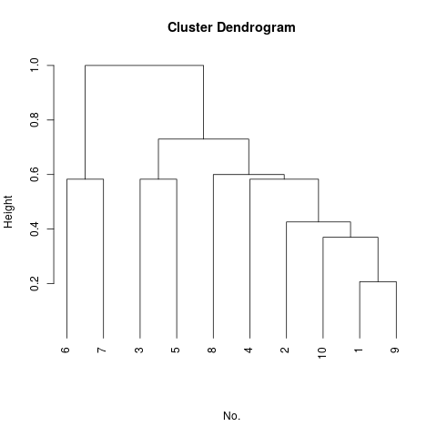

`README.md` for version 0.2.2 of Ruul.

## What is Ruul? ##

Ruul is **Fuzzy Dynamic Clustering Picture Maker**, 
which is developed by Tokhta Horqin on China University of Geosciences in China, 
and cite 谢季坚, 刘承平. 模糊数学方法及其应用[M]. 华中科技大学出版社. 2000

"uul" (pronounced Ah-Goo-La, spelling уул and ᠠᠭᠤᠯᠠ) means "Mountain" in Mongolian.

## Install ##

    R CMD build Ruul && R CMD INSTALL Ruul*.tar.gz

## Usage ##

Here is input about antenna and wing length of two species of midges, 
Af and Apf, have been identified on the basis of the front.

|        No.     |  1   |  2   |  3   |  4   |  5   |  6   |  7   |  8   |  9   | 10   |
|:--------------:| ---- | ---- | ---- | ---- |----- |----- | ---- | ---- | ---- | ---- |
| Antenna Length | 1.24 | 1.36 | 1.38 | 1.38 | 1.38 | 1.40 | 1.48 | 1.54 | 1.56 | 1.14 |
|   wing Length  | 1.72 | 1.74 | 1.64 | 1.82 | 1.90 | 1.70 | 1.82 | 1.82 | 2.08 | 1.78 |

After running the code.

    xstd <- Ruul.scale(x, scale = 1)
    r <- Ruul.dist(xstd, dist = 12)
    rt <- Ruul.closure(r)
    d <- as.dist(rt)
    hc <- hclust(d)
    plot(hc, hang = -1, sub = "", xlab = "No.")

Here is output about classifying.

## License ##

Ruul is free software distributed under the terms of GPL.

## Information ##

If you have problems, report bugs directly to [Tokhta Horqin](tokhta@outlook.com)

